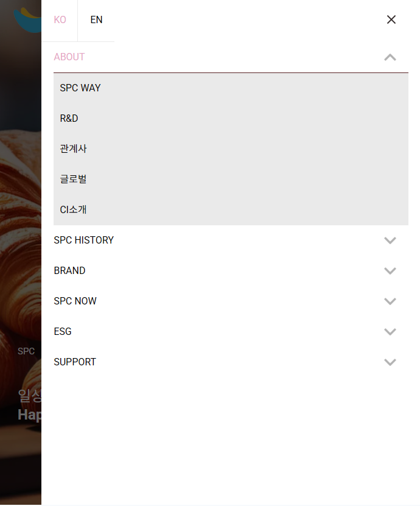
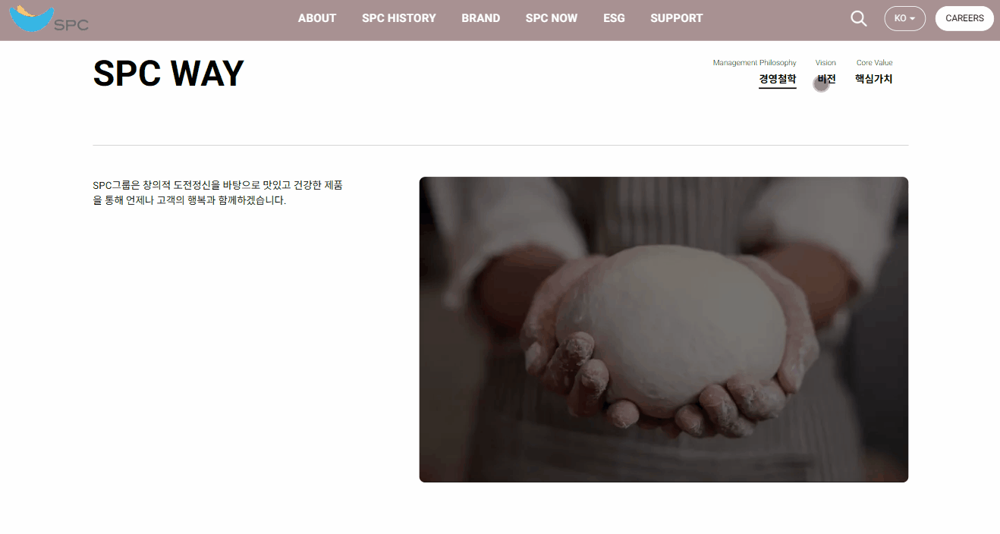
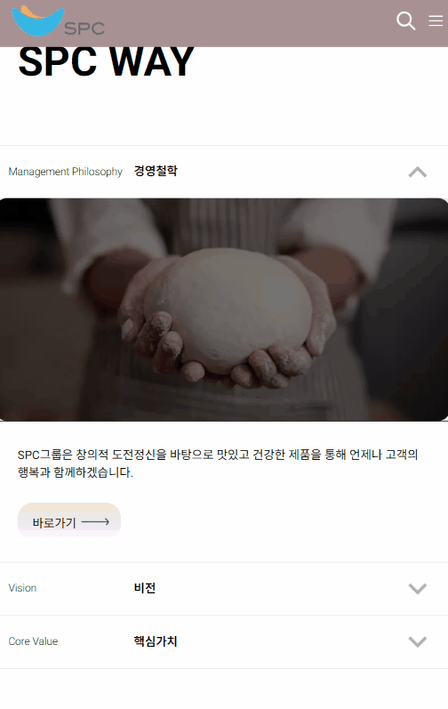

### 🍞SPC
기존 SPC 사이트를 리뉴얼 하여 React 기반으로 제작 하였으며 Javascript를 이용한 동적인 페이지를 구성 하였으며 Swiper.js를 통해 여러 이미지를 슬라이드로 구현한 반응형 웹사이트 입니다.

### ⚡Tech 


### ⚡View 
| 메인 | 슬라이더 | 모바일 |
| :-: | :-: | :-: |
|  |  |  |

## 📣Focus
* React, Redux, GSAP (GreenSock Animation Platform) 등을 활용하여 스크롤 애니메이션 및 다양한 UI구현
* 모바일 메뉴 및 페이지 내 네비게이션 구현
* CSS와 Grid 레이아웃을 활용하여 다양한 화면 크기에 최적화된 UI를 제공
* Swiper.js를 활용하여 여러 컨텐츠들을 슬라이드로 구현


### ⚡Code View 
---
<br>

```
//store.js
import { createStore } from 'redux';

// 초기 상태
const initialState = {
    isMobile: window.innerWidth <= 1280,
};

// 리듀서
const reducer = (state = initialState, action) => {
    switch (action.type) {
        case 'SET_MOBILE':
            return { ...state, isMobile: action.payload };
        default:
            return state;
    }
};

// 스토어 생성
const store = createStore(reducer);

export default store;
```

> Redux를 활용하여 현재 브라우저가 모바일 상태인지 확인하여 UI에 변화를 주었습니다. <br>
초기 상태를 1280픽셀 이하로 설정 하고 리듀서가 SET_MOBILE 상태를 받아 변화 가 있다면 SET_MOBILE 상태를 저장을 합니다.


<br><br>


<br>

```
//UiScript.js
import { useDispatch, useSelector } from "react-redux";

function UiScript() {
  const dispatch = useDispatch();
  const isMobile = useSelector((state) => state.isMobile);

	//isMobile
    const handleResize = () => {
      const mobile = window.innerWidth <= 1280;
      if (mobile !== isMobile) {
        dispatch({ type: 'SET_MOBILE', payload: mobile });
        if (mobile) {
          	...
          console.log("모바일");
        } else {
			...
			console.log("pc");
        }
      }
    };
}

```
> 스토어에 변경하려는 상태를 보내는 코드입니다. 스토어 안에 있는 initialState와 UiScript의 mobile 상태를 비교하여 변화가 있다면 ,dispatch를 통해 스토어에 상태 변화를 보내며 if문 안에 있는 내용을 실행합니다.

<br>
<br>
<br>


---
<br>


<br>

```
 // wayTopList
    const wayTopClickHandlers = [];
    wayTopList.forEach((item, i) => {
		const clickHandler = (e) => {
			e.preventDefault();

			if (!item.classList.contains("active")) {
			wayTopList.forEach((item2, j) => {
				item2.classList.remove("active");
				wayBotList[j].classList.remove("active");
			});
			item.classList.add("active");
			wayBotList[i].classList.add("active");
			}
		};
		item.addEventListener("click", clickHandler);
		wayTopClickHandlers.push({ item, clickHandler });
    });
	---------------------------------
	//이벤트 정리
	wayTopClickHandlers.forEach(({ item, clickHandler }) => {
        item.removeEventListener("click", clickHandler);
      });
	----------------------------------
```
> Redux 상태 변화가 발생할 때 페이지 로드가 다시 되기 때문에 이벤트가 중복 발생 되어 오류가 발생할 가능성이 있는데, 이벤트를 핸들러로 정의를 하여 이벤트 중복이 발생되지 않도록 하였습니다.

<br>

---

<br>



<br>

```
moWayList.forEach((item, i) => {
		const clickHandler = (e) => {
			e.preventDefault();

			if (!item.classList.contains("active")) {
			moWayList.forEach((item2, j) => {
				gsap.to(moWayTab[j], { height: 0, duration: 0.5 });
				item2.classList.remove("active");
				moWayTab[j].classList.remove("active");
			});
			gsap.fromTo(moWayTab[i], { height: 0 }, { height: "auto", duration: 0.5 });
			item.classList.add("active");
			moWayTab[i].classList.add("active");
			} else {
			gsap.to(moWayTab[i], { height: 0, duration: 0.5 });
			item.classList.remove("active");
			moWayTab[i].classList.remove("active");
			}
		};
		item.addEventListener("click", clickHandler);
		moWayClickHandlers.push({ item, clickHandler });
    });
```
> 바로 위에 있던 SPC Way 부분의 모바일 버전입니다. GSAP 라이브러리를 사용하여 클릭된 항목이 현재 활성화 상태가 아닌 경우, 모든 항목의 active 클래스를 제거하고, 관련된 콘텐츠의 높이를 0으로 설정하여 숨깁니다. 이후 클릭된 항목을 활성화 상태로 변경하고, 해당 콘텐츠의 높이를 auto로 설정하여 부드럽게 표시합니다. 이 이벤트도 마찬가지로 중복 발생을 하지 않도록 핸들러로 정의 하였습니다