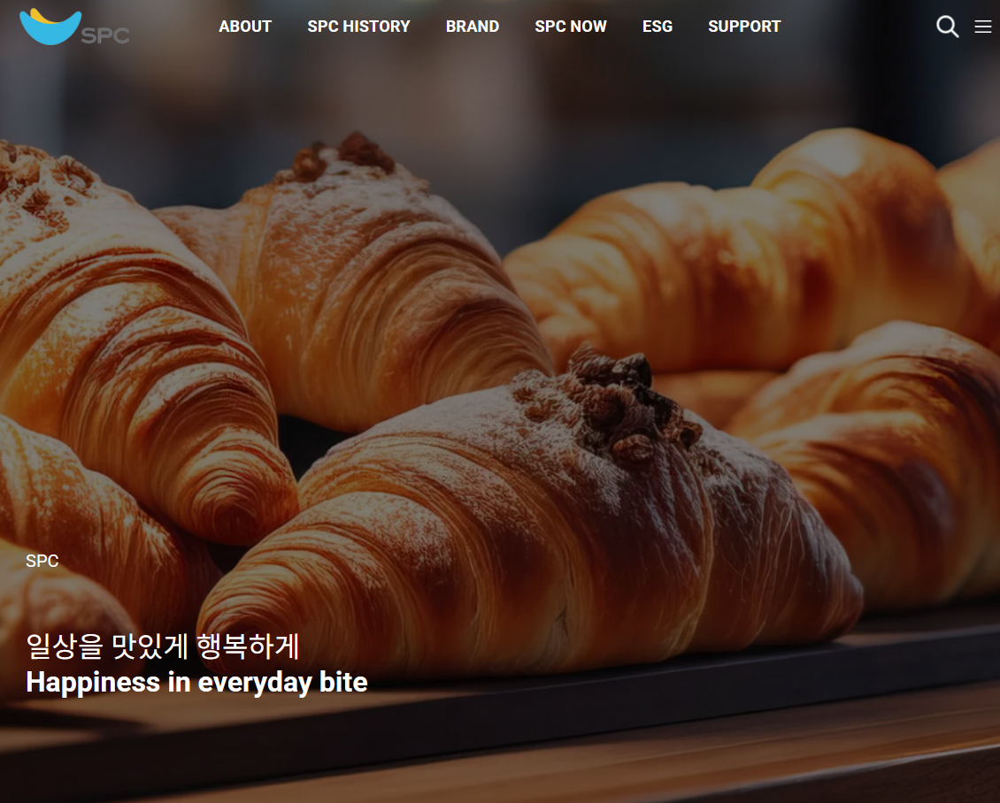
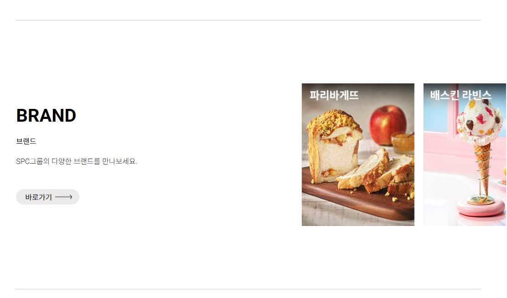

### 🍞SPC
기존 SPC 사이트를 리뉴얼 하여 React 기반으로 제작 하였으며 Javascript를 이용한 동적인 페이지를 구성 하였으며 Swiper.js를 통해 여러 이미지를 슬라이드로 구현한 반응형 웹사이트 입니다.

### ⚡Tech 

### ⚡View 
| 메인 | 슬라이더 | 모바일 |
| :-: | :-: | :-: |
|  |  |  |

## 📣Focus
* React, Redux, GSAP (GreenSock Animation Platform) 등을 활용하여 스크롤 애니메이션 및 다양한 UI구현
* 모바일 메뉴 및 페이지 내 네비게이션 구현
* CSS와 Grid 레이아웃을 활용하여 다양한 화면 크기에 최적화된 UI를 제공
* Swiper.js를 활용하여 여러 컨텐츠들을 슬라이드로 구현