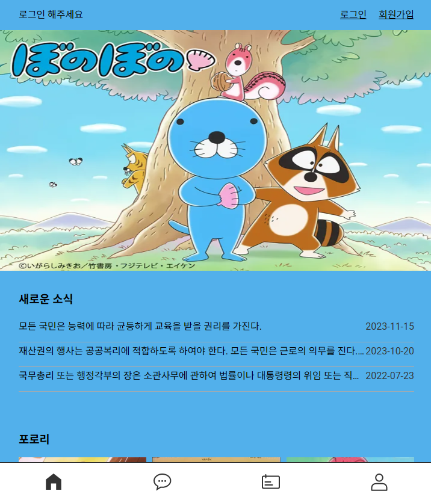
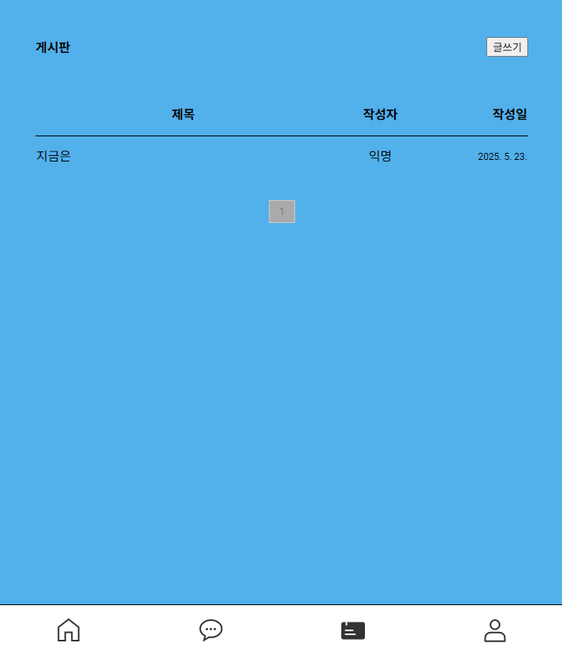
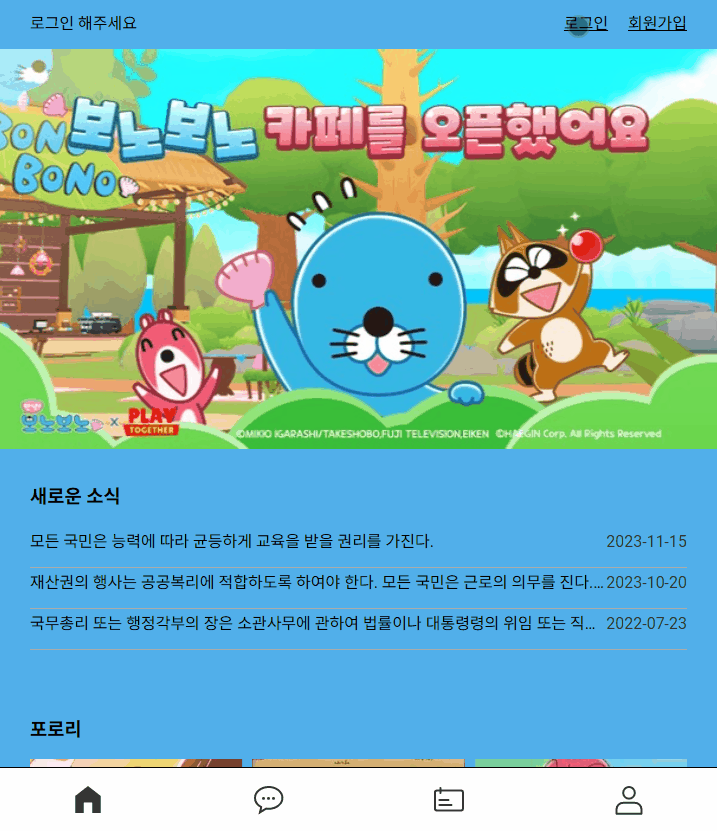
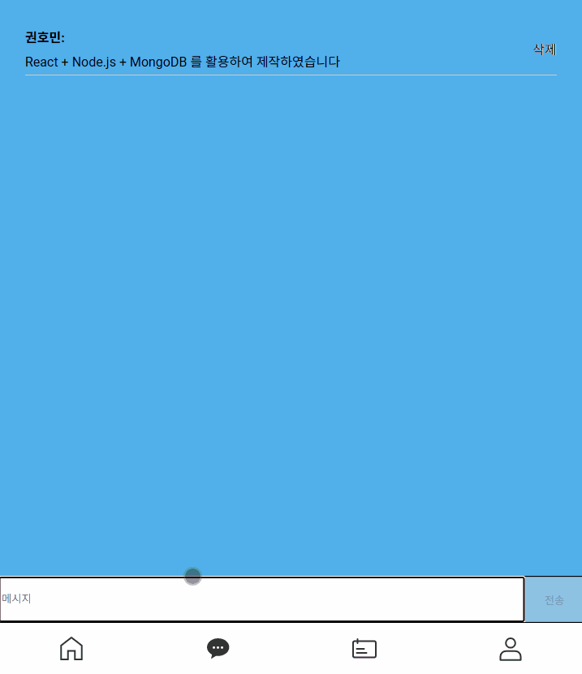

### 🍞Bonochat
실시간 채팅 기능이 포함된 모바일 전용 웹 애플리케이션으로, Node.js와 MongoDB를 기반으로 백엔드를 구성하였으며, 프론트엔드는 Next + Typescript 기반으로 제작했습니다. WebSocket을 이용해 사용자 간의 실시간 메시지 송수신을 구현하였으며, 전체 시스템은 Vercel과 Cloudetype를 활용해 배포하였습니다.서버와 DB를 직접 구성함으로써 백엔드와 실시간 통신 구조에 대한 깊은 이해를 바탕으로 개발했습니다.

프로젝트 링크 : https://bonochat.vercel.app/
### ⚡Tech 


### ⚡View 
| 메인 | 채팅 | 게시판 |
| :-: | :-: | :-: |
|  |  |  |

## 📣Focus
* Next.js + TypeScript 기반의 프론트엔드 프로젝트 설계 및 구현
* App Router 구조를 활용하여 페이지 간 라우팅을 효율적으로 구현
* Socket.IO 를 통한 실시간 통신 구현
* Axios를 활용한 비동기적 데이터 처리


### ⚡Code View 
---
<br>




<br>

```
 const login = async (name: string, password: string) => {
    try {
      const res = await axios.post(`${API_URL}/login`, { name, password });
      setUser(res.data.user);
      alert(`${res.data.user.name}님 환영합니다`);
    } catch (err: unknown) {
      if (axios.isAxiosError(err) && err.response) {
        alert(err.response.data?.error || '로그인 실패');
      } else {
        alert('로그인 실패');
      }
      throw err;
    }
  };

```
> 이 함수는 사용자가 입력한 이름과 비밀번호를 서버에 POST 요청으로 전송하여 로그인 처리하는 로직입니다. axios를 사용해 비동기적으로 로그인 요청을 보내고, 성공 시 응답에서 사용자 정보를 받아 상태로 저장하고 환영 메시지를 출력합니다. 실패할 경우에는 에러 타입을 구분하여 에러 메시지를 사용자에게 알리며, 예외를 다시 던져 후속 처리가 가능하도록 설계되었습니다. TypeScript의 타입 시스템을 활용해 안정성과 예외 처리를 강화 하였습니다.

<br>
<br>


---

<br>


<br>

```
useEffect(() => {
	socket.on('load messages', (loadedMessages) => {
		setMessages(loadedMessages);
	});

	socket.on('chat message', (msg) => {
		setMessages((prevMessages) => [...prevMessages, msg]);
	});

	socket.on('message deleted', (deletedId) => {
		setMessages((prevMessages) =>
			prevMessages.filter((msg) => msg._id !== deletedId)
		);
	});
	

	return () => {
		socket.off('load messages');
		socket.off('chat message');
		socket.off('message deleted');
	};
});
```
> WebSocket을 활용하여 실시간 메시지 수신 및 삭제 이벤트를 처리하고, useEffect를 통해 컴포넌트 생애주기에 따라 소켓 이벤트를 등록 및 해제함으로써 메모리 누수 없이 안정적으로 실시간 채팅을 구현했습니다.

<br>
<br>

---

<br>


<br>

```
const fetchPosts = async (pageNum) => {
    try {
        const res = await axios.get(`${process.env.REACT_APP_API_URL}/posts?page=${pageNum}`);
        setPosts(res.data.posts);
        setTotalPages(res.data.totalPages);
        setPage(res.data.currentPage);
    } catch (err) {
        console.error('게시글 불러오기 실패:', err);
    }
};

```
>Axios를 이용해 서버로부터 게시글 데이터를 비동기로 가져오고, 페이지 번호를 기반으로 게시글을 페이징 처리하였습니다. 서버 응답에 따라 현재 페이지와 총 페이지 수를 동적으로 설정해 효율적인 페이지 전환이 가능하도록 구현했습니다.