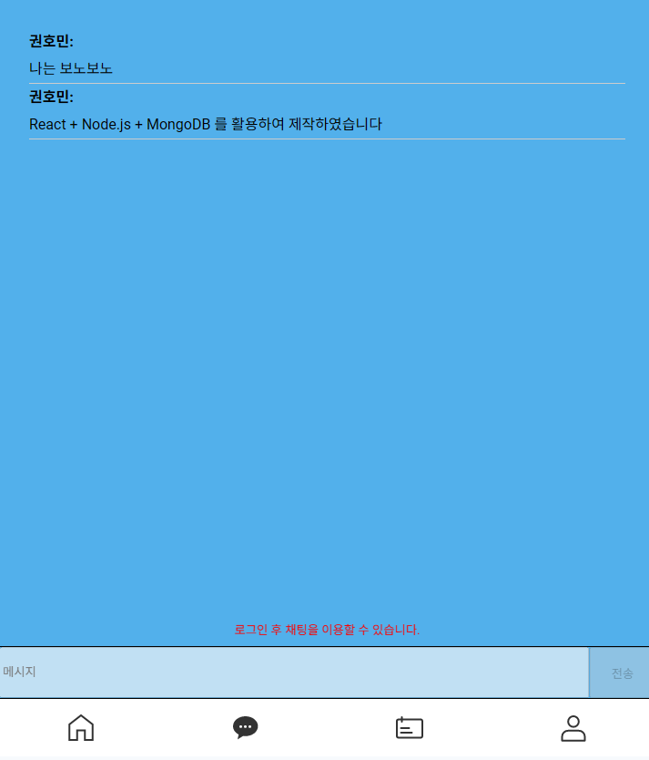
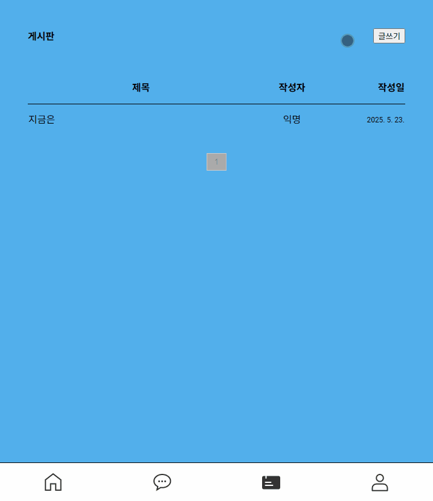

### 🍞Bonochat
실시간 채팅 기능이 포함된 모바일 전용 웹 애플리케이션으로, Node.js와 MongoDB를 기반으로 백엔드를 구성하였으며, 프론트엔드는 React 기반으로 제작했습니다. WebSocket을 이용해 사용자 간의 실시간 메시지 송수신을 구현하였으며, 전체 시스템은 Vercel과 Cloudetype를 활용해 배포하였습니다.서버와 DB를 직접 구성함으로써 백엔드와 실시간 통신 구조에 대한 깊은 이해를 바탕으로 개발했습니다.

프로젝트 링크 : https://chatting-henna-xi.vercel.app/
### ⚡Tech 


### ⚡View 
| 메인 | 채팅 | 게시판 |
| :-: | :-: | :-: |
|  |  |  |

## 📣Focus
* React, GSAP 등을 활용한 스크롤 애니메이션 및 다양한 UI구현
* node.js와 MongoDB를 활용한 서버와의 데이터 통신 및 로그인 기능 구현
* Socket.IO 를 통한 실시간 통신 구현


### ⚡Code View 
---
<br>


<br>

```
const LoginForm = ({ onLogin }) => {
    const [name, setName] = useState('');
    const [password, setPassword] = useState('');

    const handleLogin = async (e) => {
        e.preventDefault();
        try {
            const res = await axios.post(process.env.REACT_APP_API_URL + '/login', { name, password });
            onLogin(res.data.user);
            alert(`${res.data.user.name}님 환영합니다`);
        } catch (err) {
            alert(err.response?.data?.error || '로그인 실패');
        }
    };

    return (
        <form onSubmit={handleLogin} className='loginform'>
            <h3>로그인</h3>
            <input value={name} onChange={e => setName(e.target.value)} placeholder="이름" />
            <input type="password" value={password} onChange={e => setPassword(e.target.value)} placeholder="비밀번호" />
            <button type="submit">로그인</button>
        </form>
    );
};

```
> 로그인 기능은 React의 useState를 활용해 사용자 입력 상태를 관리하고, Axios를 사용하여 서버와의 비동기 통신을 구현했습니다. 사용자가 로그인 폼을 제출하면 .env에 정의된 API 주소를 통해 POST 요청을 보내고, 서버 응답에 따라 onLogin 콜백을 호출하거나 에러 메시지를 alert로 표시하도록 구성하였습니다. 기본적인 예외 처리와 함께 구조가 간결하게 유지되도록 설계하였습니다.

<br>
<br>


---

<br>


<br>

```
useEffect(() => {
	socket.on('load messages', (loadedMessages) => {
		setMessages(loadedMessages);
	});

	socket.on('chat message', (msg) => {
		setMessages((prevMessages) => [...prevMessages, msg]);
	});

	socket.on('message deleted', (deletedId) => {
		setMessages((prevMessages) =>
			prevMessages.filter((msg) => msg._id !== deletedId)
		);
	});
	

	return () => {
		socket.off('load messages');
		socket.off('chat message');
		socket.off('message deleted');
	};
});
```
> WebSocket을 활용하여 실시간 메시지 수신 및 삭제 이벤트를 처리하고, useEffect를 통해 컴포넌트 생애주기에 따라 소켓 이벤트를 등록 및 해제함으로써 메모리 누수 없이 안정적으로 실시간 채팅을 구현했습니다.

<br>
<br>

---

<br>



<br>

```
const fetchPosts = async (pageNum) => {
    try {
        const res = await axios.get(`${process.env.REACT_APP_API_URL}/posts?page=${pageNum}`);
        setPosts(res.data.posts);
        setTotalPages(res.data.totalPages);
        setPage(res.data.currentPage);
    } catch (err) {
        console.error('게시글 불러오기 실패:', err);
    }
};

```
>Axios를 이용해 서버로부터 게시글 데이터를 비동기로 가져오고, 페이지 번호를 기반으로 게시글을 페이징 처리하였습니다. 서버 응답에 따라 현재 페이지와 총 페이지 수를 동적으로 설정해 효율적인 페이지 전환이 가능하도록 구현했습니다.