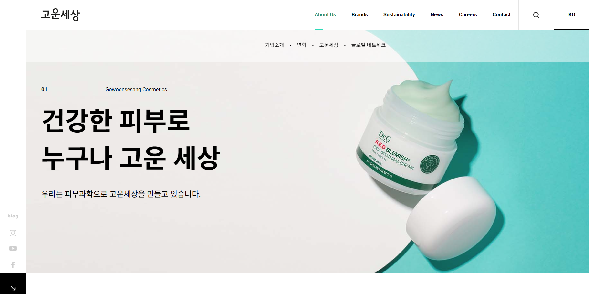
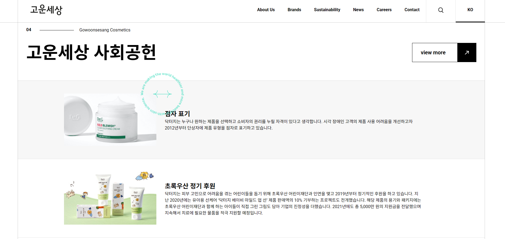
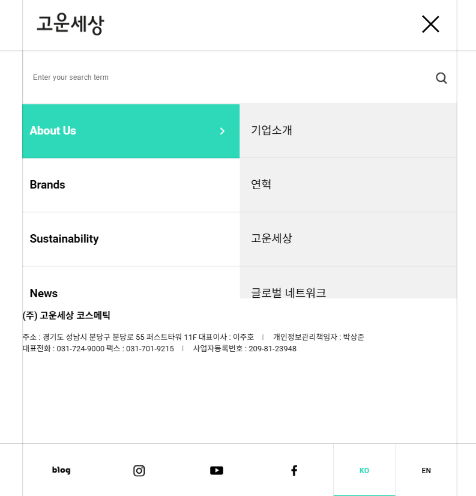

### 🍞고운세상
고운세상 사이트를 클론 코딩 하였으며
React와 GSAP를 활용해 스크롤 애니메이션과 동적 UI 인터랙션을 구현하며, ScrollTrigger와 Timeline 기법을 활용하여 모바일과 웹에서 최적화된 사용자 경험을 제공합니다.

프로젝트 링크 : 
### ⚡Tech 


### ⚡View 
| 메인 | 컨텐츠 | 모바일 |
| :-: | :-: | :-: |
|  |  |  |

## 📣Focus
* GSAP을 활용한 스크롤 애니메이션 및 UI 요소 인터랙션 구현
* 모바일 메뉴 및 페이지 내 네비게이션 구현
* 특정 페이지 위치에 도달 시 트리거되는 애니메이션 효과 적용
* i18n 라이브러리를 통한 다국어 지원

### ⚡Code View 
---

<br>

```
import i18n from "i18next";
import { initReactI18next } from "react-i18next";
import KOdata from "./KOdata";
import ENdata from "./ENdata";

const resources = {
  en: {
    translation: ENdata
  },
  ko: {
    translation: KOdata
  }
};

i18n
  .use(initReactI18next)
  .init({
    resources,
    lng: "ko",
    fallbackLng: "en",
    interpolation: {
      escapeValue: false
    }
  });

export default i18n;
```
> i18n은 웹의 국제화를 설정하기 위한 라이브러리 입니다, React 애플리케이션에서 다국어 지원을 구현하는 데 사용됩니다.한국어(KOdata)와 영어(ENdata) 번역 데이터를 포함하는 resources 객체를 정의합니다. i18n을 초기화하면서 기본 언어를 한국어로 설정하고, 대체 언어를 영어로 지정하며, HTML 이스케이프 처리를 비활성화합니다.

<br>

---

```

```
