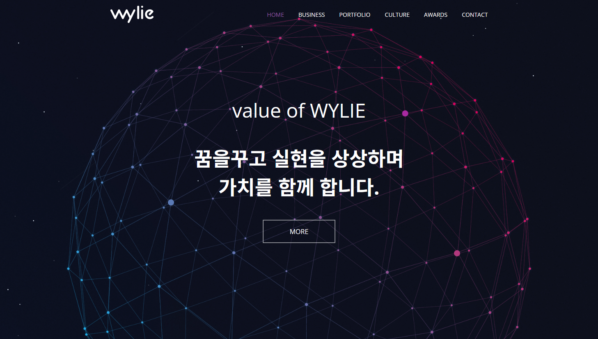
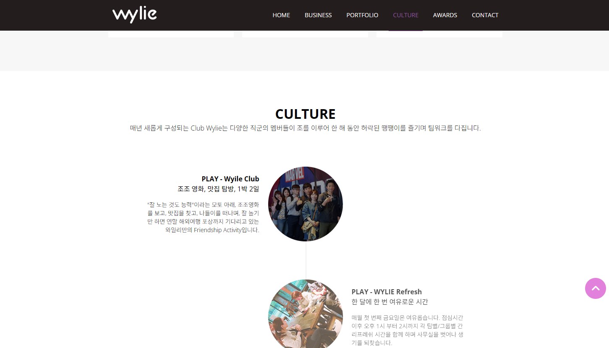
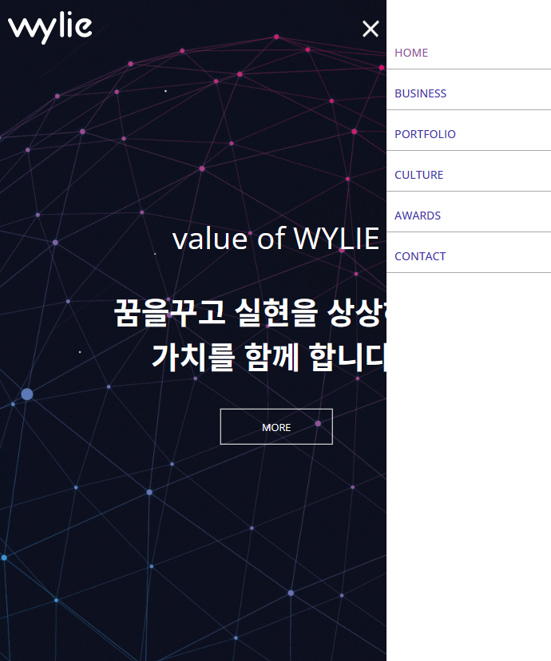
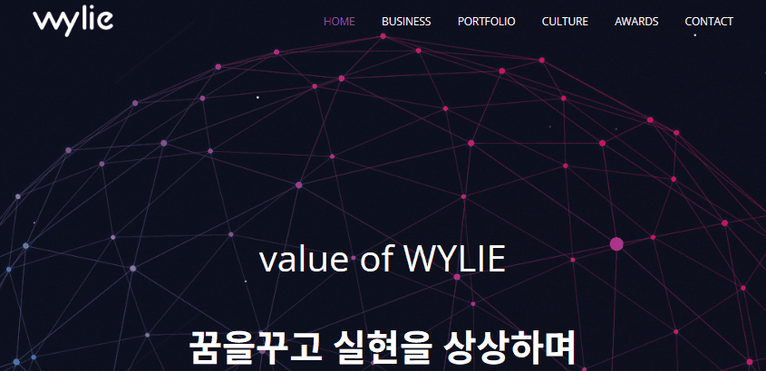

### 🍞Wylie
Wylie 사이트를 리뉴얼 하였으며
GSAP를 활용해 스크롤 애니메이션과 동적 UI 인터랙션을 구현하며, 직관적인 네비게이션, 모바일 메뉴, 위치 기반 시각적 효과로 모바일과 웹에서 최적화된 사용자 경험을 제공합니다.


### ⚡Tech 


### ⚡View 
| 메인 | 컨텐츠 | 모바일 |
| :-: | :-: | :-: |
|  |  |  |

## 📣Focus
* GSAP을 활용한 스크롤 애니메이션 및 UI 요소 인터랙션 구현
* 모바일 메뉴 및 페이지 내 네비게이션 구현
* 특정 페이지 위치에 도달 시 트리거되는 애니메이션 효과 적용

<br>

### ⚡Code View 
---

<br>



<br>

```
let pageList = [start];

	sectionList.forEach(function (item) {
		if (item.getAttribute("id") != "signature") {
			pageList.push(item);
		}
	});
```
> pageList라는 배열을 선언하여 "signature" 라는 id를 가지지 않은 섹션들을 배열에 추가합니다.

<br>

---

<br>

```
gnbList.forEach(function(item, i){
		gnbList[i].addEventListener("click", function(e){
			e.preventDefault();

			topPos=pageList[i].offsetTop;

			if(isMobile == false){
				gsap.to(window, { scrollTo: topPos, duration: 0.4 });
			}
			else{
				navList.classList.remove("active");
				navImg.classList.remove("active");
				body.classList.remove("fixed");
				tabicon();

				gsap.to(window, { scrollTo: topPos, duration: 0.4 });
			}
			
		});
	});
```

> gsap의 scrollTo를 사용하여 모바일이 아닐 경우에 gnb를 클릭하면 해당 섹션의 가장 윗부분으로 이동합니다. 